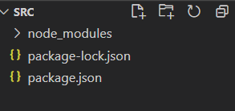
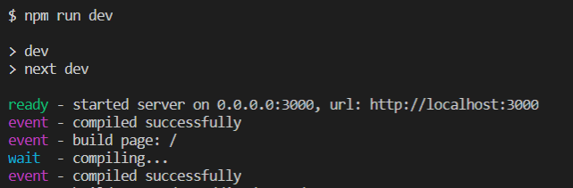
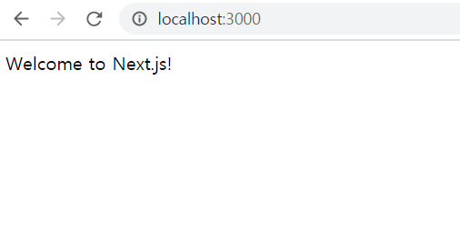

# Building markdown-based blog with Next.js

## 기획 배경

학습한 내용을 기록하고 공유할 수 있도록 기술 블로그를 운영하려고 찾아보니, 생각만큼 마음에 와닿는 블로그 서비스가 보이지 않았습니다. 우선 스스로 어떤 서비스를 원하는지 목록을 작성해보았습니다.

1. 단순한 글 작성
2. 단순하고 직관적인 글 관리
3. 필요에 따라 점진적으로 기능 추가 (검색, 최근 포스트, 다크모드 등)
4. 스타일 커스터마이징
5. DB, 서버 비용 없음

그리고 이 기준들에 가장 부합하는 것이 github pages 블로그였습니다. 기본적으로 5번이 만족되고, 특히 markdown 문서를 기반으로 한다는 점이 1, 2번을 만족하며 마음에 들었습니다. jekyll 템플릿을 이용할 경우 간편하지만 3, 4번을 제한적으로 만족할 수 밖에 없기 때문에, 직접 github pages 블로그를 구현하여 이를 만족하도록 하였습니다.

## 요구 사항

블로그 구현에 앞서 요구사항을 정리하였습니다. 우선순위에 따라 순서대로 작성하였습니다.

1. markdown 문서 기반
   - 별도의 글 작성 기능 없음
   - 파일 디렉토리를 통한 글 관리
2. 카테고리 없는 통합 글 목록
3. 모바일, PC 반응형 디자인
4. 다크모드
   - 버튼을 통해 토글 가능
   - 설정 저장하지 않고 접속할 때마다 사용자 color-scheme 설정에 따름
5. 글 제목 검색 기능
6. 해시태그 기능
   - 구현 가능 여부 불확실


## 기술 스택

최근 프론트엔드 프레임워크로 React를 공부하고 있고, 별도의 서버 없이 markdown 문서 기반으로 포스트를 보여줘야 하기에 Next.js를 채택하였습니다.


## 초기 설정

`create-next-app`을 사용하지 않고, 필요한 요소들을 하나씩 manual setup을 해보기로 했습니다.

### npm 패키지 설치

Next 공식 홈페이지의 설명을 따라 React와 Next를 설치합니다.

``` bash
npm install next react react-dom
```

프로젝트 폴더에는 `node-modules`폴더와 두 개의 기본적인 json 파일이 생성되었습니다.



`package.json`파일에서 `"scripts"` 를 작성하여 next 명령어를 등록해줍니다.

``` json
// package.json
{
  "dependencies": {
    "next": "^10.0.9",
    "react": "^17.0.2",
    "react-dom": "^17.0.2"
  },
  "scripts": {
    "dev": "next dev",
    "build": "next build",
    "start": "next start",
  }
}
```


### 기본 폴더 구조 설정

Next에서 각 url 주소는 `pages` 폴더 아래의 경로 및 파일과 상응합니다. `pages`폴더를 생성하고, 그 안에 `index.js` 파일을 생성해줍니다.

``` bash
mkdir pages
touch pages/index.js
```

`pages/index.js`는 기본 경로에서 표시할 컴포넌트입니다. 간단한 함수 컴포넌트를 정의하여 제대로 렌더링되는지 확인해보겠습니다.

``` js
// pages/index.js
function HomePage() {
  return <div>Welcome to Next.js!</div>
}

export default HomePage
```

위에서 `package.json`에 작성한 npm 명령어를 통해 개발 버전으로 확인해보겠습니다.

``` bash
npm run dev
```

터미널에 ready 표시와 함께 출력되는 url을 통해 작성한 Next 앱을 확인할 수 있습니다.



브라우저에서 해당 주소로 접속하면 `build page: /` 가 출력되고, 해당 컴포넌트를 컴파일해 화면에 보여줍니다. 



## 배포

git subtree 기능을 이용하여 `gh-pages ` 브랜치를 생성하고, 이를 통해 배포 파일을 관리하도록 하였습니다.
`package.json` 파일에서 scripts에 명령어를 추가하여 `next export`와 git subtree 푸시를 자동화 하였습니다.

``` json
// package.json
{
	//...
  "scripts": {
		// ...
    "predeploy": "next export",
    "deploy": "git add out && git commit -m 'deploy gh pages' && git subtree push --prefix out origin gh-pages"
  }
}
```

