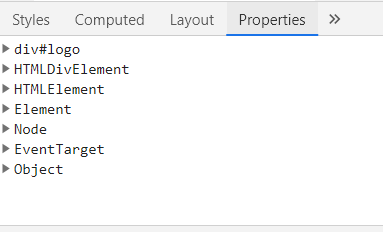

## 들어가며

자바스크립트는 동적인 웹페이지를 구현하기 위해 만들어진 스크립트 언어입니다. 동적인 웹페이지를 구현하는 것의 대부분은 문서의 구조나 스타일, 콘텐츠를 변경하는 것이며 이는 DOM(Document Object Model) 조작을 통해 가능합니다. 그렇다면 DOM은 무엇이고 DOM을 조작한다는 것은 어떤 의미인지, 그리고 기본적인 DOM 조작은 어떤 방법들이 있는지 알아보았습니다.


## TL; DR

- DOM은 HTML 문서에 접근하고 조작하기 위한 Web API
- DOM의 객체들은 DOM 인터페이스를 상속해 속성과 메서드를 구현
- DOM 인터페이스의 속성 및 메서드를 사용해 DOM에 접근 및 조작 가능


## 1. DOM이란?

- 브라우저의 맥락에서 자바스크립트는 핵심 언어인 [ECMA스크립트](https://www.ecma-international.org/publications-and-standards/standards/ecma-262/)와 다양한 기능을 제공하는 [Web API](https://developer.mozilla.org/ko/docs/Web/API)로 구성되어 있으며, DOM은 대표적인 Web API 중 하나입니다.

- HTML, XML 문서의 **프로그래밍 인터페이스**로, 문서의 객체를 나타내고 상호작용할 수 있게 합니다.

- DOM은 문서의 내용과 구조를 노드 트리로 표현하고, 스크립트 언어는 DOM을 통해 문서의 구조, 스타일, 콘텐츠 등을 변경할 수 있습니다.

- 주로 자바스크립트에 의해 사용되지만, 플랫폼 중립적이므로 파이썬 등의 다른 언어를 통해 사용할 수도 있습니다.

  > DOM 표준 규격은 W3C, WHATWG에서 각각 발표하고 있었으나, 앞으로 단일 버전으로 개발될 예정입니다. 
  >
  > [ZDNet 관련기사](https://zdnet.co.kr/view/?no=20190531184644)


## 2. DOM 인터페이스

- DOM은 HTML/XML 문서를 다룰 수 있도록 [DOM 인터페이스](https://www.w3.org/TR/2004/REC-DOM-Level-3-Core-20040407/DOM3-Core.html#introduction-ID-E7C30826)를 명시하고 있습니다.

- DOM 인터페이스는 일종의 추상화된 기본 클래스로, 각각의 속성(Attributes)과 메서드를 가지고 있습니다.

- 대표적으로 [EventTarget](https://developer.mozilla.org/ko/docs/Web/API/EventTarget), [Node](https://developer.mozilla.org/ko/docs/Web/API/Node), [HTMLElement](https://developer.mozilla.org/ko/docs/Web/API/HTMLElement) 등이 있습니다.

- DOM의 객체들은 인터페이스를 상속받아 구현하며, addEventListener, appendChild 등 DOM 조작을 위해 사용하는 메서드들은 해당 객체가 상속받은 DOM 인터페이스의 메서드를 사용하는 것이라고 할 수 있습니다.

- MDN 문서에서 특정 속성이나 메서드를 검색하면, 앞에 인터페이스를 정의하는 것을 볼 수 있습니다.

  - ex: [Element.classList](https://developer.mozilla.org/ko/docs/Web/API/Element/classList)

- 아래 그림과 같이 계층적 구조를 가지고 있으며, 하위 인터페이스는 상위 인터페이스를 상속합니다.

  

- 개발자도구 - Elements - Properties 탭에서 해당 노드 객체가 상속받은 인터페이스와 각각의 속성 및 메서드를 확인할 수 있습니다.




## 3. DOM 조작

- DOM 조작은 문서의 요소들이 구현하고 있는 인터페이스의 속성과 메서드를 이용해 가능합니다.

- 기본적으로 DOM 요소를 생성/참조/수정/삭제하는 방법에 대해 작성하였습니다.

  


### 1) 요소 접근 및 선택

- `Document` 인터페이스의 메서드를 이용해 노드에 접근하고 참조할 수 있습니다.

  ```js
  // Document.getElementById(): 해당 id 속성을 가진 요소를 반환합니다.
  // 웹 호환성을 위해 일반 요소에서 사용할 수 없으며, ParentNode에도 구현되어있지 않습니다.
  // 엄밀히는 NoneElementParentNode 인터페이스이며 Document, DocumentFragment가 구현합니다.
  const app = document.getElementById('app');
  
  // Document.getElementByClassName(): 해당 class 속성을 가진 요소를 NodeList 객체로 묶어 반환합니다.
  const searchResult = document.getElementByClassName('search-result');
  
  // Document.getElementByTagName(): 해당 tagName 속성을 가진 요소를 NodeList 객체로 묶어 반환합니다.
  const header = document.getElementByTagName('header');
  ```

- `ParentNode`  믹스인 인터페이스의 메서드를 이용하는 방법도 있습니다.

- `ParentNode`는 `Element`, `Document`, `DocumentFragment` 인터페이스에서 구현됩니다.

  ``` js
  // querySelector: CSS 선택자를 이용하여 일치하는 요소 중 첫번째 요소를 반환합니다.
  const headerLogo = document.querySelector('header.logo');
  
  // querySelectorAll: CSS 선택자를 이용하여 일치하는 모든 요소를 NodeList로 반환합니다. 
  const activeList = document.querySelectorAll('.active');
  ```

- 또는 `Node` 인터페이스의 속성을 통해 요소 접근 및 선택이 가능합니다.

  ``` js
  // 해당하는 노드가 없으면 null을 반환합니다.
  // text 및 comment 또한 노드이므로, 해당 속성을 통해 선택할 수 있으므로,
  // 요소만 선택하고자 할 때는 중간에 Element를 포함한 메서드를 사용합니다.
  
  Node.parentNode             // 현재 요소노드의 부모 노드
  Node.previousSibling        // 이전 형제 노드
  Node.previousElementSibling // 이전 형제 요소 노드
  Node.nextSibling            // 다음 형제 노드
  Node.nextElementSibling     // 다음 형제 요소 노드
  Node.firstChild             // 현재 요소의 첫번째 자식 노드
  Node.firstElementChild      // 현재 요소의 첫번째 자식 요소 노드
  Node.lastChild              // 현재 요소의 마지막 자식 노드
  Node.lastElementChild       // 현재 요소의 마지막 자식 요소 노드
  ```


### 2) 콘텐츠 참조 및 수정

- `Element` 인터페이스의 `innerHTML` 속성을 이용해 콘텐츠를 참조하고 수정할 수 있습니다.

  ``` js
  const header = document.createElement('header');
  - `innerText`는 HTML요소를 제거한 순수한 문자열만을 반환합니다.
  // Element.innerHTML: 요소에 포함된 마크업을 가져오거나 설정합니다.
  header.innerHTML = '<h1>hello world</h1>';
  console.log(header.innerHTML) // "<h1>hello world</h1>"
  
  // Element.innerText: 
  console.log(header.innerText) // "hello world"
  ```

  

- `Node` 인터페이스의 `innerText` 속성을 이용해 렌더링된 텍스트 콘텐츠만 참조하거나 수정할 수 있습니다.

  ``` js
  header.innerText = 'oops!';
  console.log(header.innerText); // "oops!"
  ```

- `Node` 인터페이스의 `textContent` 속성은 `innerText`보다 먼저 정의되어 사용되었으나, 현재 모던 브라우저에서는 동일하게 작동합니다.


### 3) 새 요소 만들기

- `Document` 인터페이스의 `createElement()` 메서드를 이용해 새 요소를 만들 수 있습니다.

- 새로 만들어진 요소는 다른 메서드를 사용해 DOM에 추가하기 전까지는 메모리에만 존재합니다.

  ``` js
  const title = document.createElement('h1');
  title.innerText = 'DOM Manupulation Practice';
  console.log(title); // <h1>DOM Manupulation Practice</h1>
  ```

- `Document` 인터페이스의 `createElementFragment()` 메서드를 이용해 `documentFragment`를 생성할 수 있습니다.

- 새로 만들어진 `documentFragment`는 DOM에 추가되기 전까지 메모리 상에만 존재하므로, 요소를 추가하고 수정하는 것은 리플로우를 발생시키지 않으므로 퍼포먼스를 향상시킬 수 있습니다.

  ``` js
  const frag = document.createElementFragement();
  ```

  

### 4) 요소 추가 및 수정하기

- `Node` 인터페이스의 메서드를 이용해 요소를 추가하거나 수정할 수 있습니다.

  ``` js
  const header = document.createElement('header');
  
  // Node.appendChild(): 새로운 노드를 마지막 자녀 노드로 추가할 수 있습니다.
  const title = document.createElement('h1');
  title.innerText = 'DOM Manupulation';
  header.appendChild(title);
  console.log(header); // <header><h1>DOM Manupulation</h1></header>
  
  // Node.insertBefore(): 참조한 자녀 노드 앞에 다른 노드를 추가할 수 있습니다.
  const logo = document.createElement('img');
  logo.src = 'https://someImageSource...';
  header.insertBefore(logo, title);
  console.log(header); // <header><h1>DOM Manupulation</h1></header>
  ```


- `ParentNode` 믹스인 인터페이스의 `append` 메서드를 이용할 수도 있습니다.

  - 노드를 추가하거나 `DOMString`을 `text` 노드처럼 추가할 수 있습니다.
  - 여러 개의 노드를 한 번에 추가할 수 있습니다.

  ``` js
  const parent = document.createElement('div');
  const h1 = document.createElement('h1');
  const h2 = document.createElement('h2');
  
  parent.append('practice', h1, h2);
  
  console.log(parent.innerHTML); // "practice<h1></h1><h2></h2>"
  ```

  

- `ChildNode` 인터페이스의 메서드를 이용해 참조된 자녀노드에 대해 DOM 조작을 할  수 있습니다.

- `ChildNode` 인터페이스는 믹스인(mixin)으로, 부모를 가질 수 있는 `Node`객체에 메서드를 제공합니다.

  ``` js
  const parent = document.createElement('div');
  const child = document.createElement('h2');
  parent.appendChild(child);
  console.log(parent); // <div><h2></h2></div>
  
  // before(): 해당 노드의 앞에 다른 노드를 삽입합니다.
  const h1 = document.createElement('h1');
  child.before(h1);
  console.log(parent); // <div><h1></h1><h2></h2></div>
  
  // after(): 해당 노드의 앞에 다른 노드를 삽입합니다.
  const h3 = document.createElement('h3');
  child.after(h3);
  console.log(parent); // <div><h1></h1><h2></h2><h3></h3></div>
  
  // replaceWith(): 해당 노드를 다른 요소 노드 또는 텍스트 노드로 대체합니다.
  const p = document.createElement('p');
  child.replaceWith(p);
  console.log(parent); // <div><h1></h1><p></p><h3></h3></div>
  
  //remove(): 참조된 자녀 노드를 자식 목록에서 제거합니다.
  p.remove();
  console.log(parent); // <div><h1></h1><h3></h3></div>
  ```


- 이외에도 DOM 인터페이스의 다양한 속성과 메서드를 이용해 DOM 조작을 할 수 있습니다.
- 더 알아보려면 MDN에서 각 DOM 인터페이스를 검색하거나, W3C의 [DOM  표준 문서](https://www.w3.org/TR/dom41/)를 참고할 수 있습니다.


---

### 참고자료

- [MDN - DOM 소개](https://developer.mozilla.org/ko/docs/Web/API/Document_Object_Model/%EC%86%8C%EA%B0%9C)
- [W3C - DOM 4.1](https://www.w3.org/TR/dom41/)
- [TuturialPost - JavaScript 웹개발과 DOM](https://tutorialpost.apptilus.com/code/posts/js/w02-script-tag/)